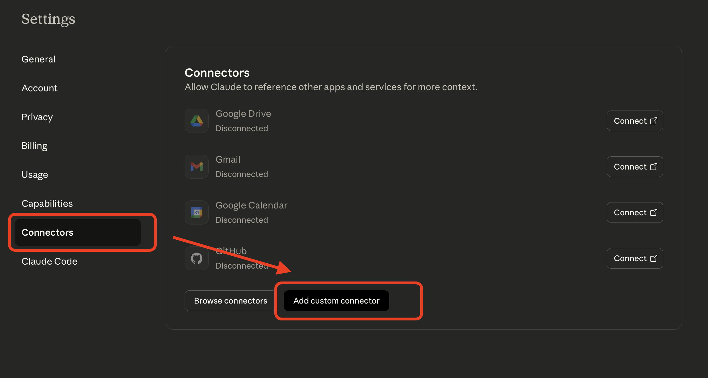
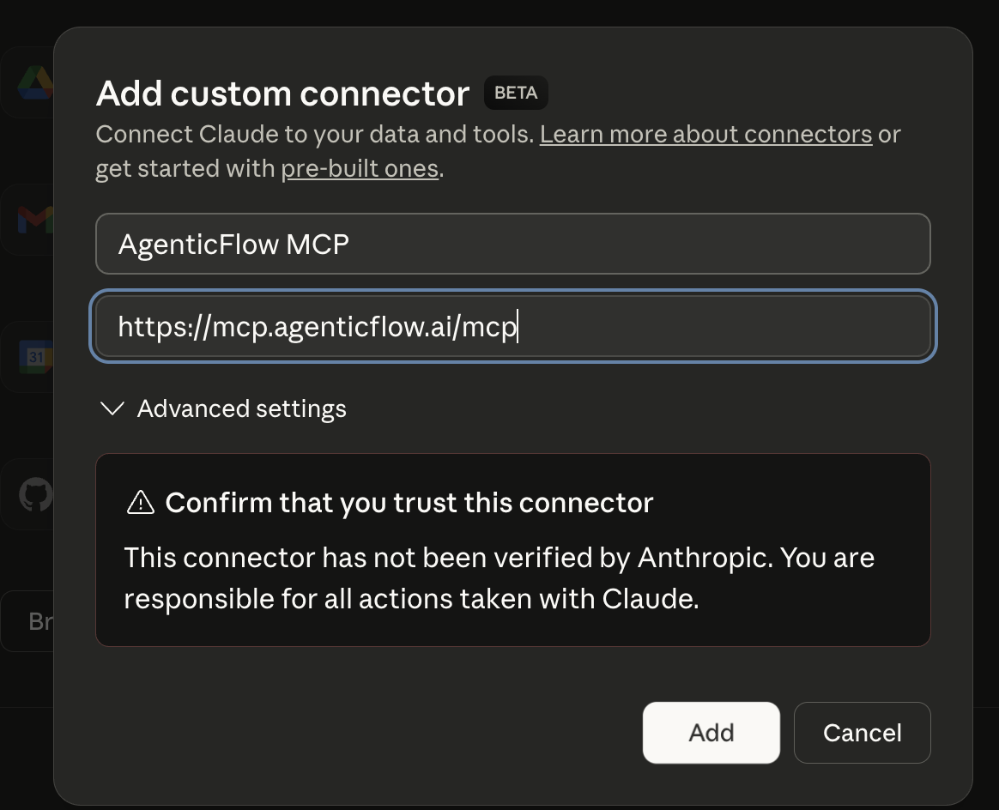
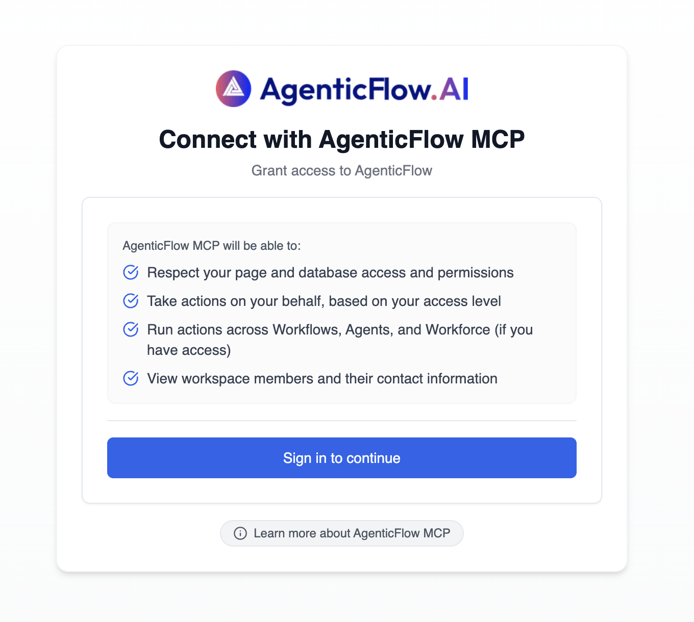
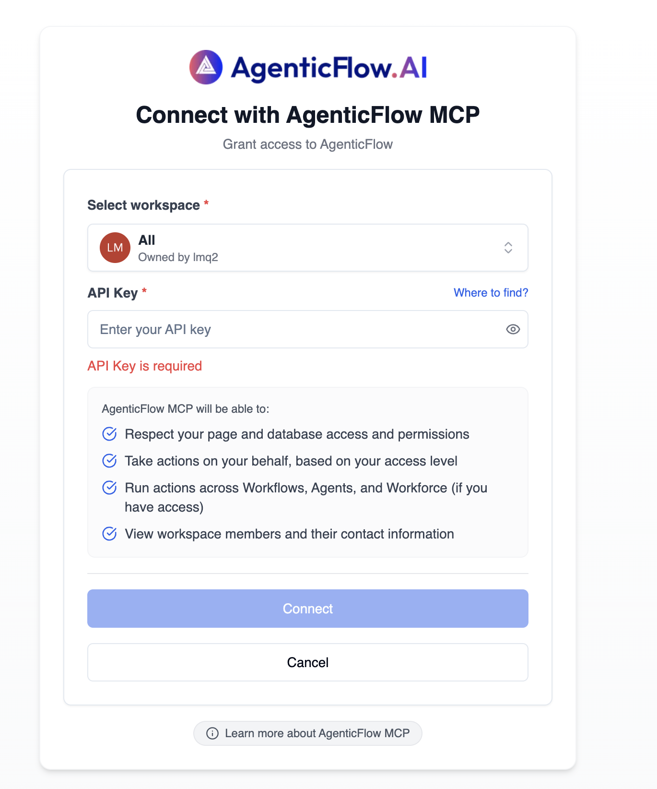
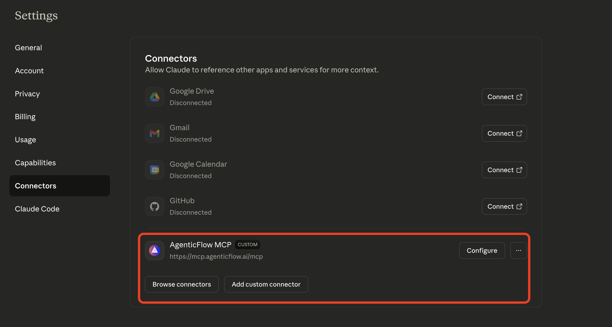
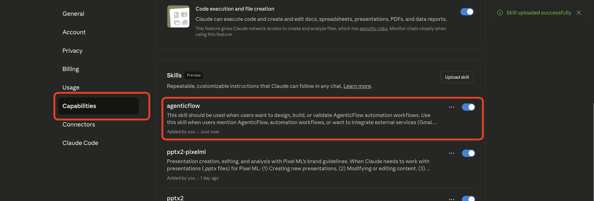
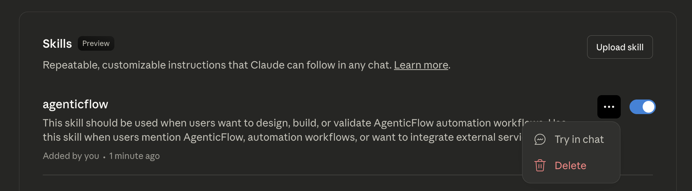

# AgenticFlow Skill for Claude

[](https://github.com/anthropics/claude-code)
[](https://claude.ai)
[](LICENSE)

A comprehensive skill that enables Claude to design, build, and validate [AgenticFlow](https://agenticflow.ai) automation workflows using both standard nodes and the extensive MCP ecosystem of 2,500+ integrations.

**Works with both Claude Code and Claude.ai** (Pro, Team, and Enterprise plans)

## Table of Contents

- [What is AgenticFlow?](#what-is-agenticflow)
- [Features](#features)
- [Quick Start](#quick-start)
- [Usage](#usage)
- [What's Included](#whats-included)
- [Detailed Setup Guide](#detailed-setup-guide)
- [Troubleshooting](#troubleshooting)
- [How It Works](#how-it-works)
- [Key Capabilities](#key-capabilities)
- [Contributing](#contributing)
- [License](#license)
- [Support](#support)
- [Connect With Us](#connect-with-us)

## What is AgenticFlow?

AgenticFlow is an AI automation platform that connects to virtually any service to create sophisticated automation workflows. This skill enables Claude to help you:

- Design complex automation workflows
- Integrate with external services (Gmail, Slack, Shopify, CRM systems, etc.)
- Mix standard nodes with MCP integrations for powerful automations
- Validate and optimize workflow logic
- Provide direct links to created workflows

## Features

- **2,500+ Service Integrations**: Access CRM, communication, e-commerce, productivity, marketing tools and more
- **Hybrid Workflow Design**: Combine standard nodes with MCP integrations
- **Comprehensive Node Library**: Web scraping, AI processing, data extraction, and more
- **Workflow Validation**: Built-in validation before workflow creation
- **Best Practices**: Parallel processing patterns, error handling, and optimization guidance

## Quick Start

### For Claude Code Users

Get up and running in 3 steps:

1. **Install AgenticFlow MCP Server** (one-time setup):
   ```bash
   npm install -g @anthropic-ai/claude-code
   claude mcp add --transport http agenticflow https://mcp.agenticflow.ai/mcp
   ```

2. **Install the Skill**: Download [agenticflow.zip](agenticflow.zip) and run `/skills install` in Claude Code

3. **Start Building**: Ask Claude to help you create AgenticFlow workflows!

### For Claude.ai Users

**Note**: Skills are included in Pro, Team, and Enterprise plans at no additional cost.

1. **Add AgenticFlow MCP Connector**:
   - Go to [Claude.ai Settings → Connectors](https://claude.ai/settings/connectors)
   - Click "Add custom connector"
   - Enter connector name: `AgenticFlow MCP`
   - Enter URL: `https://mcp.agenticflow.ai/mcp`
   - Click "Add" to connect
   - Sign in to AgenticFlow and select your workspace
   - Enter your API key (get it from [AgenticFlow API Keys](https://docs.agenticflow.ai/get-started/api-keys))
   - Click "Connect"

   **📸 See [Detailed Setup Guide](#detailed-setup-guide) below for step-by-step instructions with screenshots**

2. **Upload the Skill**:
   - Download [agenticflow.zip](agenticflow.zip)
   - Go to Settings → Capabilities in Claude.ai
   - In the "Skills" section, click "Upload skill"
   - Select the downloaded ZIP file
   - Toggle the skill ON (blue toggle)

3. **Start Using**: Click "Try in chat" or the skill will activate automatically when you mention AgenticFlow or automation workflows!

## Usage

Once installed, the skill activates automatically when you:

- Mention "AgenticFlow" in your conversation
- Ask about automation workflows
- Request integration with external services (Gmail, Slack, Shopify, etc.)

### Example Conversations

**Design a workflow:**
```
"Help me create an AgenticFlow workflow that scrapes competitor pricing
and updates a Google Sheet"
```

**External service integration:**
```
"I need to sync Shopify orders to my CRM and send Slack notifications
when high-value orders come in"
```

**Workflow optimization:**
```
"Review this AgenticFlow workflow and suggest improvements for
parallel processing"
```

## What's Included

### Main Skill Document
- **SKILL.md**: Core workflow process, best practices, and examples

### Visual Setup Guide
- **assets/screenshots/**: 7 screenshots showing the complete setup process for Claude.ai

### Reference Documentation
- **mcp_integrations.md**: Complete MCP integration reference with popular actions by category
- **node_types.md**: Node type selection guide with field requirements
- **workflow_guide.md**: Workflow design patterns including hybrid and parallel processing

## Detailed Setup Guide

### For Claude.ai Users (Web Interface)

#### Step 1: Add Custom Connector

Go to [Claude.ai Settings → Connectors](https://claude.ai/settings/connectors) and click "Add custom connector" button



#### Step 2: Enter Connector Details

In the dialog that appears:
- **Connector Name**: `AgenticFlow MCP`
- **URL**: `https://mcp.agenticflow.ai/mcp`



Click "Add" to continue.

#### Step 3: Authenticate with AgenticFlow

You'll be redirected to the AgenticFlow authentication page. Click "Sign in to continue"



#### Step 4: Select Workspace and Enter API Key

1. Select your AgenticFlow workspace
2. Enter your API key

**Where to find your API key**: Get it from [AgenticFlow API Keys](https://docs.agenticflow.ai/get-started/api-keys)



Click "Connect" to complete the setup.

#### Step 5: Verify Connection

Back in Claude.ai Settings, you should see "AgenticFlow MCP" listed as a custom connector with "Configure" button.



✅ **MCP Connector Setup Complete!**

#### Step 6: Upload the AgenticFlow Skill

Now that the MCP connector is set up, upload the skill:

1. Go to [Claude.ai Settings → Capabilities](https://claude.ai/settings/capabilities)
2. Scroll to the "Skills" section
3. Click "Upload skill" button
4. Select the downloaded `agenticflow.zip` file
5. Once uploaded, toggle the skill ON (blue toggle switch)
6. Click "Try in chat" to test the skill




✅ **Complete Setup!** You can now use the AgenticFlow skill in Claude.ai.

---

### For Claude Code Users (Terminal)

#### Step 1: Install Claude Code CLI

```bash
npm install -g @anthropic-ai/claude-code
```

#### Step 2: Add AgenticFlow MCP Server

```bash
claude mcp add --transport http agenticflow https://mcp.agenticflow.ai/mcp
```

#### Step 3: Follow Authentication Prompts

The CLI will guide you through:
1. Signing in to AgenticFlow
2. Selecting your workspace
3. Entering your API key

**Where to find your API key**: Get it from [AgenticFlow API Keys](https://docs.agenticflow.ai/get-started/api-keys)

#### Step 4: Verify Installation

Run the following to verify the MCP server is configured:

```bash
claude mcp list
```

You should see `agenticflow` in the list of configured MCP servers.

✅ **Setup Complete!** You can now use the AgenticFlow skill in Claude Code.

---

## Troubleshooting

### "Connection Failed" Error

- Verify your API key is correct
- Check that you have an active AgenticFlow account
- Ensure you selected the correct workspace

### "Not Authorized" Error

- Your API key may have expired
- Generate a new API key from [AgenticFlow API Keys](https://docs.agenticflow.ai/get-started/api-keys)
- Reconfigure the connector with the new key

## How It Works

The skill follows a systematic 7-step process:

1. **Health Check**: Verify API connectivity
2. **Discovery**: Understand requirements and identify needed nodes/MCP actions
3. **MCP Integration Analysis**: Determine external service integrations
4. **Configuration**: Plan node configurations and data flow
5. **Pre-Building**: Structure complete workflow architecture
6. **Building**: Create the workflow mixing standard nodes and MCP integrations
7. **Validation**: Validate structure and document requirements

## Key Capabilities

### Standard Node Types
- Web scraping and research (Perplexity, OpenAI, Google)
- AI processing (LLM, Claude, OpenAI)
- Data extraction and structuring
- Image generation
- Email sending

### MCP Integrations (2,500+ Services)

**CRM & Sales**
- HubSpot, Salesforce, Pipedrive

**Communication**
- Gmail, Slack, Teams, WhatsApp

**E-commerce**
- Shopify, WooCommerce, Stripe

**Productivity**
- Google Sheets, Notion, Airtable

**Marketing**
- Mailchimp, Facebook, LinkedIn

**Project Management**
- Asana, Trello, Jira

And thousands more!

## Contributing

Contributions are welcome! Please feel free to submit a Pull Request.

## License

This skill is open source and available under the MIT License. See [LICENSE](LICENSE) for details.

## Support

- **Issues**: Report bugs or request features via [GitHub Issues](https://github.com/PixelML/agenticflow-skill/issues)
- **AgenticFlow Documentation**: [https://docs.agenticflow.ai](https://docs.agenticflow.ai)
- **Discord Community**: [https://qra.ai/discord](https://qra.ai/discord)
- **YouTube Channel**: [https://www.youtube.com/@AgenticFlow](https://www.youtube.com/@AgenticFlow)
- **Start Building**: [https://agenticflow.ai](https://agenticflow.ai)

## Acknowledgments

Built with the [Claude Code Skills Framework](https://docs.claude.com/claude-code/skills)

---

## Connect With Us

🌐 **Website**: [https://agenticflow.ai](https://agenticflow.ai)
📚 **Documentation**: [https://docs.agenticflow.ai](https://docs.agenticflow.ai)
💬 **Discord Community**: [https://qra.ai/discord](https://qra.ai/discord)
🎥 **YouTube**: [https://www.youtube.com/@AgenticFlow](https://www.youtube.com/@AgenticFlow)
🐙 **GitHub**: [https://github.com/PixelML/agenticflow-skill](https://github.com/PixelML/agenticflow-skill)

---

**Made with ❤️ for the AgenticFlow community**
